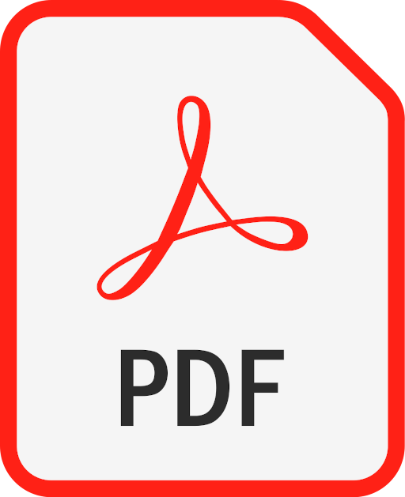

## Neuro-symbolic Metalearning and AutoML
Workshop co-hosted at [ECML/PKDD 2023](https://2023.ecmlpkdd.org/){:target="_blank" rel="noopener"}. 

Date: September 18, 2023 (afternoon)

Location: PoliTo Room 4i

### Invited Speakers

* [Carlos Soares](https://sigarra.up.pt/feup/en/func_geral.formview?p_codigo=235847){:target="_blank" rel="noopener"}, University of Porto, Portugal
* [Artur d'Avila Garcez](https://www.city.ac.uk/about/people/academics/artur-davila-garcez){:target="_blank" rel="noopener"}, City University of London, UK
* [Bernhard Pfahringer](https://profiles.waikato.ac.nz/bernhard.pfahringer){:target="_blank" rel="noopener"}, University of Waikato, New Zealand

### Program 

* 14:30 - 14:40 opening {:target="_blank" rel="noopener"}
* 14:40 - 15:15 keynote by **Bernhard Pfahringer: Learning from Data Streams versus Continual Learning** {:target="_blank" rel="noopener"}
* 15:15 - 15:35 selected paper presentation I: Zhivar Sourati Hassan Zadeh (Information Sciences Institute); Vishnu Priya Prasanna Venkatesh (USC/ISI); Darshan Deshpande (USC/ISI); Himanshu Rawlani (USC/ISI); Filip Ilievski (USC/ISI); Hông Ân Sandlin (Cyber-Defence Campus, armasuisse Science and Technology); Alain Mermoud (Cyber-Defence Campus, armasuisse Science and Technology): **Robust and explainable identification of logical fallacies in natural language arguments** {:target="_blank" rel="noopener"}
* 15:35 - 15:55 selected paper presentation II: Katarzyna Woźnica (Warsaw University of Technology); Mateusz Grzyb (Warsaw University of Technology); Zuzanna Trafas (Poznan University of Technology); Przemyslaw Biecek (Warsaw University of Technology): **Consolidated learning - a domain-specific model-free optimization strategy with validation on metaMIMIC benchmarks** {:target="_blank" rel="noopener"}
* 16:00 - 16:30 coffee break + poster session
* 16:30 - 16:45 poster session (finish)
* 16:45 - 17:20 keynote by **Carlos Soares: Synthetic data for a better understanding of models and algorithms: GANs for stress testing and other methods** {:target="_blank" rel="noopener"}
* 17:20 - 17:55 keynote by **Artur d'Avila Garcez: Neurosymbolic AI Contributions to Metalearning** {:target="_blank" rel="noopener"}
* 17:55 - 18:00 closing

### List of Posters 

* Katarzyna Woźnica (Warsaw University of Technology); Mateusz Grzyb (Warsaw University of Technology); Zuzanna Trafas (Poznan University of Technology); Przemyslaw Biecek (Warsaw University of Technology): **Consolidated learning - a domain-specific model-free optimization strategy with validation on metaMIMIC benchmarks**
* Kaixin Ma (Carnegie Mellon University); Filip Ilievski (USC/ISI); Jonathan M Francis (Carnegie Mellon University); Eric Nyberg (CMU); Alessandro Oltramari (Bosch Research Pittsburgh): **Coalescing Global and Local Information for Procedural Text Understanding** {:target="_blank" rel="noopener"}
* Jiarui Zhang (USC/ISI); Filip Ilievski (USC/ISI); Kaixin Ma (CMU); Jonathan M Francis (Bosch Center for AI; Carnegie Mellon University); Alessandro Oltramari (Bosch Research Pittsburgh): **A Study of Zero-shot Adaptation with Commonsense Knowledge** {:target="_blank" rel="noopener"}
* Mansour Sami (Edinburgh Napier University); ASHKAN SAMI (Edinburgh Napier University); Peter Barclay (Edinburgh Napier University): Unveiling the Boundaries: **Diversity Guardrails in Generative AI and Their Limitations**
* Inês Gomes (University of Porto); Carlos Soares (University of Porto); Luis F Teixeira (INESC TEC and University of Porto); Jan N. van Rijn (Leiden University); André Restivo (University of Porto): **Interpretable Generative Stress Testing**
* Fernando Freitas (University of Porto); Pavel Brazdil (INESC TEC); Carlos Soares (University of Porto): **Exploring the Reduction of Configuration Spaces of Workflows** {:target="_blank" rel="noopener"}
* Lionel Kielhofer (Leiden University); Felix Mohr (Universidad de La Sabana); Jan N. van Rijn (Leiden University): **Learning curve extrapolation techniques across extrapolation settings** {:target="_blank" rel="noopener"}
* Luísa B. Shimabucoro (University of Sao Paulo), Timothy M. Hospedales (University of Edinburgh) and Henry Gouk (University of Edinburgh): **Evaluating the Evaluators: Are Current Few-Shot Learning Benchmarks Fit for Purpose?** {:target="_blank" rel="noopener"}

### Organization

#### General organizers / Program Chairs (ordered by last name)
* [Pavel Brazdil](http://www.liaad.up.pt/area/pbrazdil/pavel-brazdil){:target="_blank" rel="noopener"}, University of Porto, Portugal
* [Henry Gouk](https://www.henrygouk.com/){:target="_blank" rel="noopener"}, University of Edinburgh, Scotland
* [Jan N. van Rijn](https://www.universiteitleiden.nl/en/staffmembers/jan-van-rijn){:target="_blank" rel="noopener"}, Leiden University, The Netherlands
* [Md Kamruzzaman Sarker](https://mdkzaman.com/){:target="_blank" rel="noopener"}, Bowie State University, USA

### Call For Papers
This workshop explores different types of meta-knowledge, such as performance summary statistics or pre-trained model weights. 
One way of acquiring meta-knowledge is by observing learning processes and representing it in such a way that it can be used later to improve future learning processes. 
AutoML systems typically explore meta-knowledge acquired from a single task, e.g., by modelling the relationship between hyperparameters and model performance. 
Metalearning systems, on the other hand, normally explore metaknowledge acquired on a collection of machine learning tasks. 
This can be used not only for selection of the best workflow(s) for the current task, but also for adaptation and fine-tuning of a prior model to the new task. 
Many current AutoML and metalearning systems exploit both types of meta-knowledge. 
Neuro-symbolic systems explore the interplay between neural network-based learning and symbol-based learning to get the best of those two types of learning. 
While doing so, it tries to use the existing knowledge as a concrete symbolic representation or as a transformed version of the symbolic representation suited for the learning algorithm. 
The goal of this workshop is to explore ways in which ideas can be cross-pollinated between the AutoML/Metalearning and neuro-symbolic learning research communities. 
This could lead to, e.g., systems with interpretable meta-knowledge, and tighter integration between machine learning workflows and automated reasoning systems. 

Main research areas:

* Controlling the learning processes
* Definitions of configuration spaces
* Few-shot learning
* Elaboration of feature hierarchies
* Exploiting hierarchy of features in learning
* Meta-learning
* Conditional meta-learning
* Meta-knowledge transfer
* Transfer learning
* Transfer of prior models
* Transfer of meta-knowledge between systems
* Symbolic vs subsymbolic meta-knowledge
* Neuro-symbolic learning 
* Explainable and interpretable meta-learning
* Explainable artificial intelligence

### Program Committee

* Shikha Bordia (Verisk Analytics)
* Kemilly Dearo
* Hugo Jair Escalante(INAOE)
* Eibe Frank (University of Waikato)
* Joao Gama (INESC TEC - LIAAD)
* Dagmar Gromann (University of Vienna)
* Filip Ilievski (USC/ISI)
* Adwaita Jadhav (Apple)
* Pavel Kordík (Czech Technical University in Prague)
* Lars Kotthoff (University of Wyoming)
* Bo Liu (Auburn University)
* Robin Manhaeve (KU Leuven)
* Bernhard Pfahringer (University of Waikato)
* Peter van der Putten (Leiden University)
* Thalea Schlender (CWI, LUMC)
* Martin Wistuba (Amazon)

### Submission

This workshop hosts the following tracks:

* Original paper track: Authors can submit novel papers, that have not been accepted elsewhere. Please format your submission according to the LaTeX [Lecture Notes in Computer Science](https://www.springer.com/gp/computer-science/lncs){:target="_blank" rel="noopener"} format, maximal 12 pages. (closed)
* Poster of already published work: Authors can apply for a poster spot for a paper that has recently (less than 2 years) been published elsewhere. During submission, you send a link to the already published version of the work, and the peer-review will determine whether it is a good match based on the topic. (closed)
* Late breaking papers: Authors can submit a 2-page abstract of already published work, or work to be published, that will undergo a light review process tailored towards applicability towards the workshop. The work will end up in the proceedings. (closed)

Submissions go through [the Conference Management Tool](https://cmt3.research.microsoft.com/ECMLPKDDworkshop2023/){:target="_blank" rel="noopener"}, please ensure to select the right track: `Neuro-symbolic Metalearning and AutoML`. 

Please use the [template suggested by the organisation of ECML/PKDD](https://resource-cms.springernature.com/springer-cms/rest/v1/content/19238648/data/v6){:target="_blank" rel="noopener"}

### Format of the Workshop

The workshop will last a half a day. It will include: 

* Invited talks
* Short oral presentations
* Poster session 
* Panel discussions on "Neuro-symbolic Metalearning and AutoML"

### Proceedings

Accepted papers can decide to opt-in to the formal workshop proceedings of ECML/PKDD 2023. The authors of accepted papers can decide whether they wish to have their full paper included or not. In the latter case, publication of a short abstract would be possible.

### Important Dates

* Workshop paper submission deadline: June 26, 2023 (updated)
* Workshop paper author notification: July 24, 2023 (updated)
* Camera ready deadline: End of July 2023
* Late breaking papers submission deadline: August 31st, 2023
* Workshop: September 18, 2023 (afternoon)
